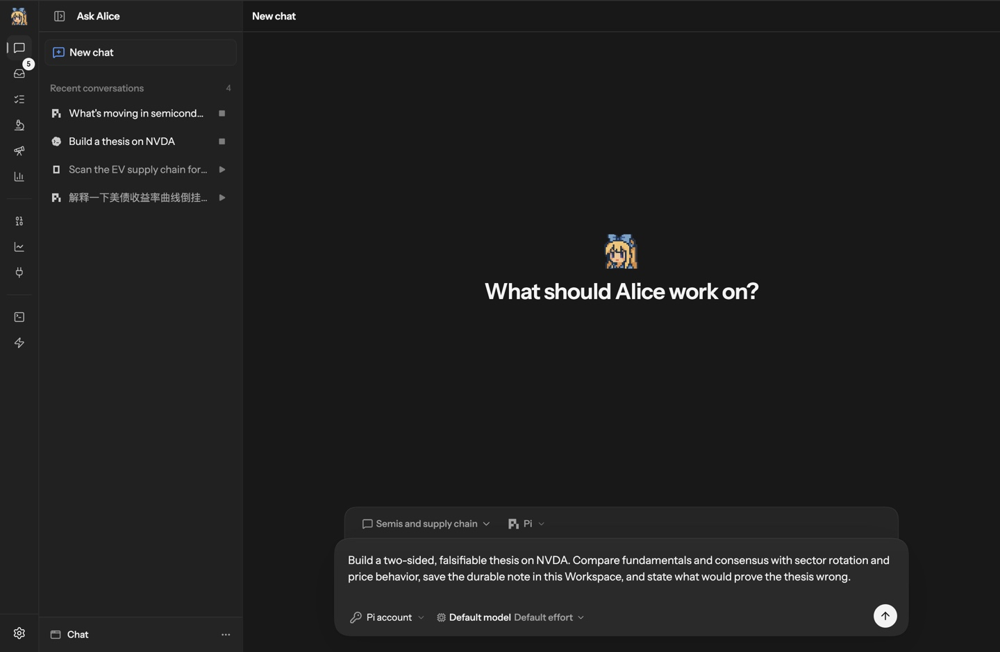
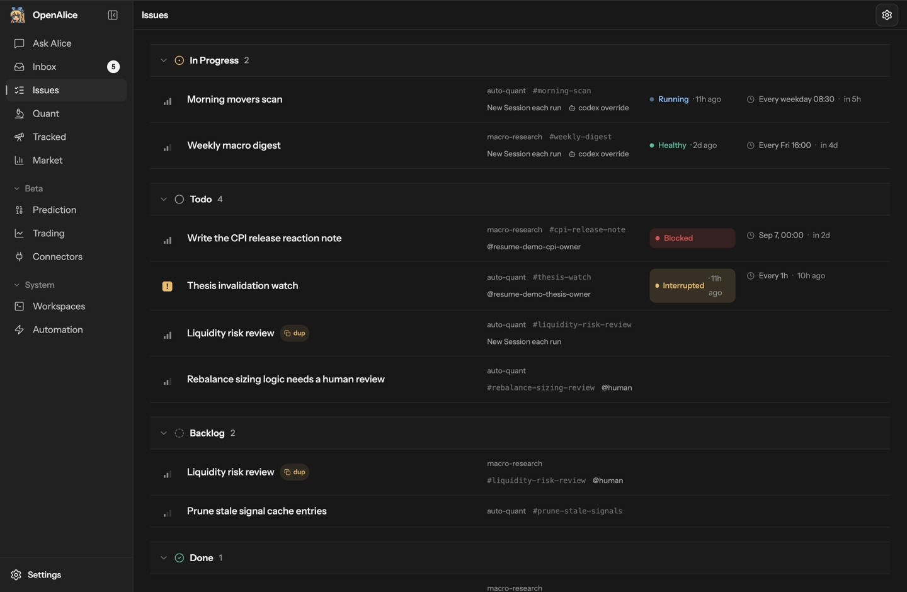
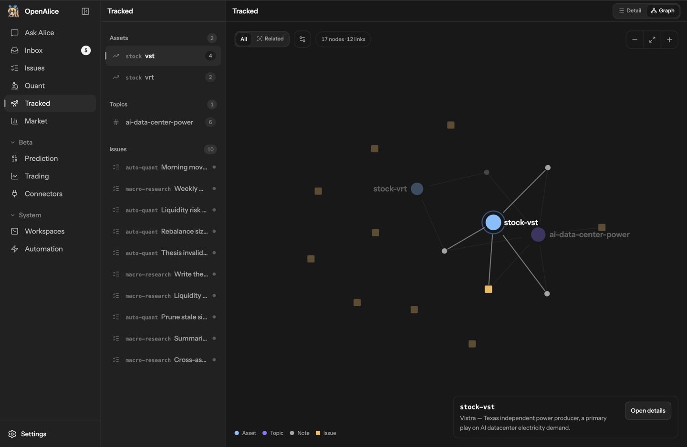
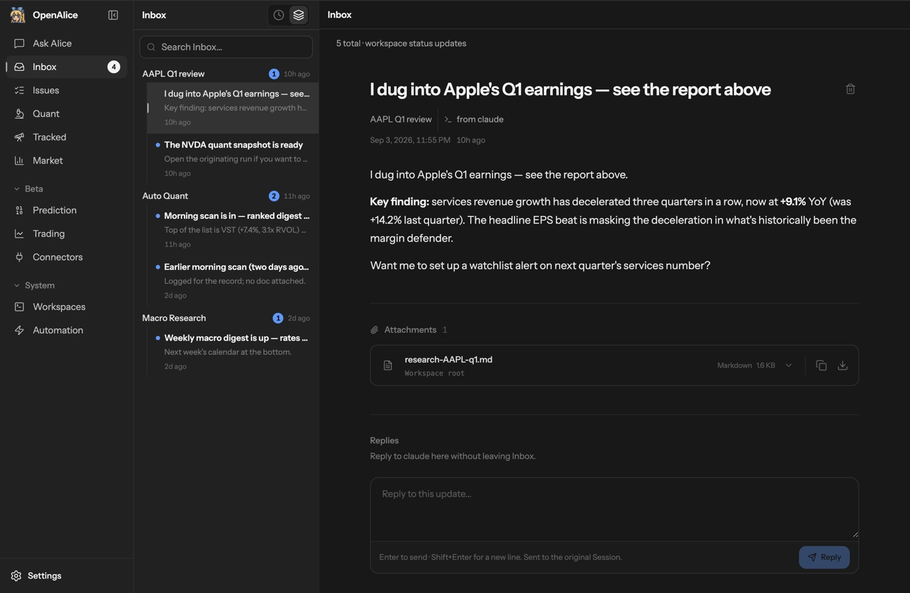
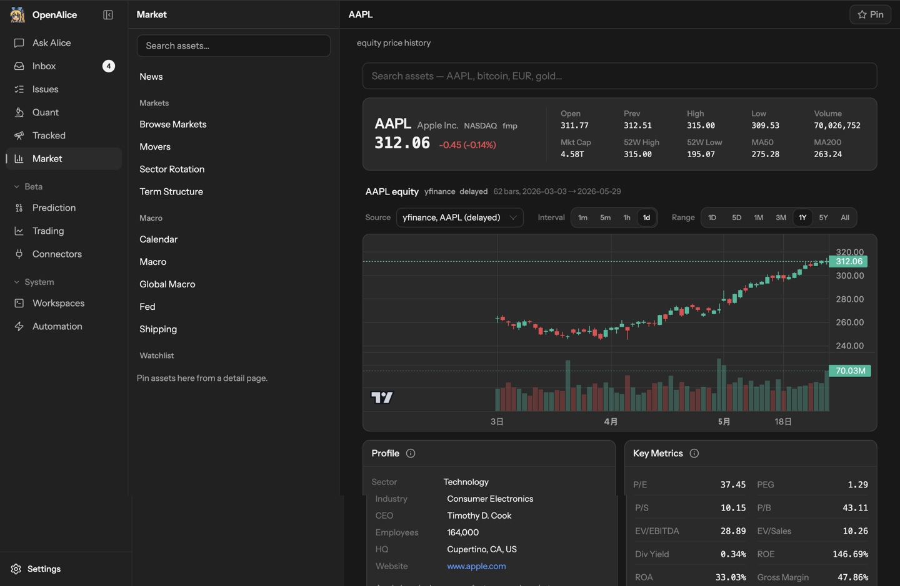
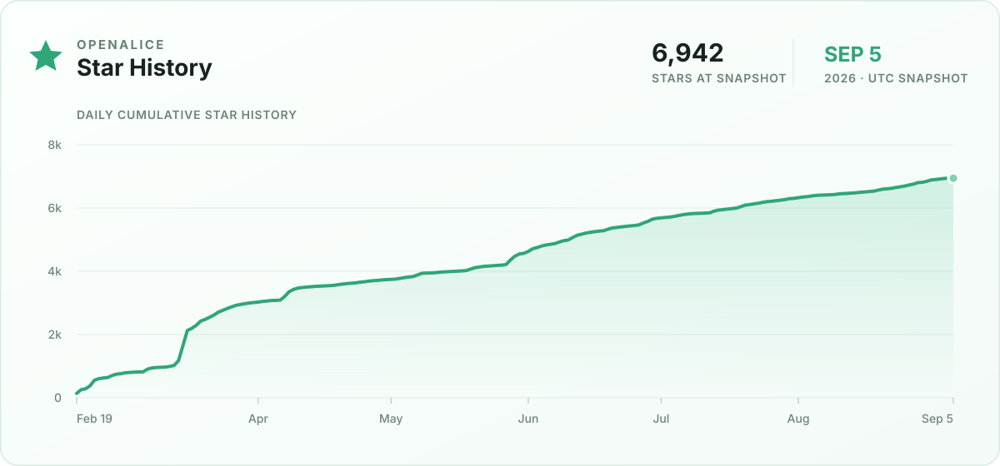

<p align="center">
  
</p>

<h1 align="center">OpenAlice</h1>

<p align="center">
  <strong>The AI orchestrator for trading.</strong><br>
  Your one-person Wall Street — bring your AI agents, market tools, research, and trading accounts into one local workspace.
</p>

<p align="center">
  <a href="https://openalice.ai"></a> · <a href="https://openalice.ai/docs"></a> · <a href="https://x.com/OpenAliceAI"></a> · <a href="https://discord.gg/zf4STmrQd8"></a> · <a href="https://qm.qq.com/q/iSg6O4FmrC"></a>
</p>

<p align="center">
  <a href="https://openalice.ai/docs/getting-started/installation">Install OpenAlice</a> · <a href="#features">Features</a> · <a href="https://openalice.ai/docs/getting-started/quick-start">Quick Start</a>
</p>

<p align="center">
  
</p>

Research a company, test an idea, keep a thesis under review, or prepare a trade.
OpenAlice connects the agents you already use to market data, dedicated research
workspaces, scheduled tasks, and trading accounts. Work with one agent or several;
your files, research history, and follow-ups stay in place between sessions.

## Get Started

[Download the desktop app](https://github.com/TraderAlice/OpenAlice/releases/latest)
for macOS or Windows. The desktop app includes Pi; connect a model credential or
supported login to start researching. **You do not need a broker account.**

Prefer a terminal or server? See the [CLI installer](docs/cli-installer.md),
[remote quickstart](docs/remote-quickstart.md), or
[Docker setup](https://openalice.ai/docs/deployment/docker).
For platform details, see the [installation guide](https://openalice.ai/docs/getting-started/installation).

Try a first task in Ask Alice:

> Build a thesis on NVDA. Compare fundamentals with sector trends and price
> behavior, save the research in this Workspace, and explain what would prove
> the thesis wrong.

Continue with a follow-up, turn it into a recurring Issue, or take the idea into
AutoQuant for quantitative research. [Walk through your first research workflow →](https://openalice.ai/docs/getting-started/quick-start)

## Features

### Put your agents to work with market tools

Use Claude Code, Codex, OpenCode, Pi, Oh My Pi, and other supported native agents
with Alice's market data, fundamentals, news, and quantitative tools. Inspect the
same markets yourself in the UI, then ask an agent to investigate further.
Available data depends on your configured providers.

### Give each line of research a place to grow

Keep conversations, files, and Git history together in reusable Workspaces.
Use Chat for general research, AutoQuant for quantitative projects and experiments,
and Auto Prediction for prediction-market research. The specialist workspaces
have their own Studio interfaces and can be developed by the agent working inside them.

### Keep following the ideas that matter

Link research to assets and topics in Tracked. Turn follow-up work into Issues
with instructions and a schedule: a morning scan, a weekly macro review, or a
recurring check on a thesis. Scheduled runs use the Workspace's agent and context.

### Get results you can follow up on

Inbox brings together reports, questions, and updates from your Workspaces.
Open the research file or reply to the Session that produced it. Use Workspace
Manager to inspect who owns what, review scheduled work, and coordinate across
Workspaces when you need a wider view.

<table>
  <tr>
    <td></td>
    <td></td>
  </tr>
  <tr>
    <td align="center"><strong>Keep research moving</strong><br>Issues, schedules, and work that needs attention.</td>
    <td align="center"><strong>Connect your research</strong><br>Assets, topics, and the work behind your ideas.</td>
  </tr>
  <tr>
    <td></td>
    <td></td>
  </tr>
  <tr>
    <td align="center"><strong>Read, then follow up</strong><br>Reports and a direct path back to their author.</td>
    <td align="center"><strong>Explore the market</strong><br>Prices, fundamentals, and context for your next question.</td>
  </tr>
</table>

### Bring research to a trading decision

Connect supported brokers through Unified Trading Account to inspect holdings,
orders, and account state. With AI trading enabled, agents can stage proposed
operations and commit their rationale. You review and approve execution through
Trading as Git.

> [!CAUTION]
> **Trading execution is beta.** Start with simulator, paper, demo, or testnet
> accounts. OpenAlice is experimental software; interfaces may change, and it
> provides no guarantees of correctness, reliability, profitability, or loss prevention.
> Use real funds only if you understand and accept the risks.

[Unified Trading Account](https://openalice.ai/docs/core-concepts/unified-trading-account) · [Trading as Git](https://openalice.ai/docs/core-concepts/trading-as-git)

## Local and Yours

OpenAlice runs on your machine by default. Workspaces are directories and Git
repositories you can inspect, edit, and back up. Alice stores its own state under
`~/.openalice` and seals broker credentials at rest. Your chosen agents and data
providers still use their configured services.

Native agents keep their own model loops and tool behavior. Workspace files,
skills, and dedicated research projects give them the context to do trading work.

[Data, credentials, and backups →](https://openalice.ai/docs/deployment/data-and-credentials)

## Documentation and Help

- [Documentation](https://openalice.ai/docs) — setup, research workflows, agents, and trading.
- [Discord](https://discord.gg/zf4STmrQd8) · [QQ group](https://qm.qq.com/q/iSg6O4FmrC) — questions and community.
- [GitHub Issues](https://github.com/TraderAlice/OpenAlice/issues) — report a bug or propose an improvement.
- [DeepWiki](https://deepwiki.com/TraderAlice/OpenAlice) — explore the codebase.

## Development

```bash
git clone https://github.com/TraderAlice/OpenAlice.git
cd OpenAlice
pnpm install
pnpm dev
```

Open the UI URL printed by the terminal. Source installs need at least one host
agent CLI and its model credentials or login.
See [Source & Dev](https://openalice.ai/docs/getting-started/developer-setup) for
setup and [CONTRIBUTING.md](CONTRIBUTING.md) before opening a PR.

## Star History

<p align="center">
  <a href="https://github.com/TraderAlice/OpenAlice">
    <picture>
      <source media="(prefers-color-scheme: dark)" srcset="docs/images/star-history-dark.svg">
      
    </picture>
  </a>
</p>

<p align="center">
  <a href="https://github.com/TraderAlice/OpenAlice"></a>
</p>

## Contributors

OpenAlice is sharper for the people who dig into it with us: the bugs they
catch, the ideas they push, the UX edges they notice, the designs and reviews
they bring. High-signal issues and PR proposals count here. If a report,
suggestion, or implementation proposal changes the product, it gets credited.

<!-- Standouts first. Avatars come free from https://github.com/<handle>.png -->
<p>
  <a href="https://github.com/bakabird"></a>
  <a href="https://github.com/2233admin"></a>
  <a href="https://github.com/lvysssss"></a>
  <a href="https://github.com/walkonbothsides"></a>
  <a href="https://github.com/bakabaka0613"></a>
  <a href="https://github.com/JasonWang1124"></a>
  <a href="https://github.com/rudyll"></a>
  <a href="https://github.com/jalilsedna"></a>
  <a href="https://github.com/dbydd"></a>
  <a href="https://github.com/enderzcx"></a>
</p>

**See the full list and what each person shaped**: [CONTRIBUTORS.md](./CONTRIBUTORS.md)

## License

[AGPL-3.0](LICENSE)
